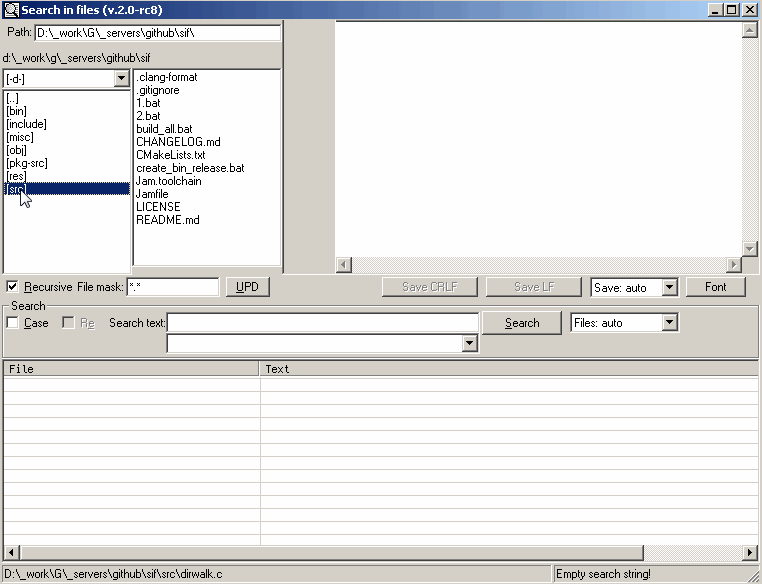

# Search In Files

## Description

This small tool is intended to search text in multiple files.
Search results are not only file name, line and column numbers,
but additionally the whole line from file.

Click on search result loads whole file into edit control with highlight
of found text.
Text could be edited and saved right there.

This tool understands both cp1251 and utf-8 text encodings and
both CRLF and LF line endings.

Initial path where program begin to work can be set in
different ways:

* It supports command line argument
* Folder can be drag'n'dropped into main window
* From Explorer folder could be "SendTo" to "Search in files"
  (Program automatically creates shortcut in SendTo folder)

It works on Windows platform (XP, Vista, 7).
Also it should work on Windows 2000, Windows 8, Windows 10, but such cases
have not been tested yet.

This tool is written in C programming language with no "bold"
framework (MFC, .NET, ...) involved. Raw WinAPI only.
Due to this it has small size, it has no complex dependencies and thus it can work
without any installation procedures (other than simple exe-file copy).

No administrative priviledges are required.

Alternatively it could be installed by means of
[Chocolatey package manager](https://chocolatey.org/packages/sif)
as a portable app.

## Hotkeys

* ENTER - start search
* ESC - close program
* UP and DOWN arrows navigate through search history backward and forward
  (when cursor is in "Search text" field)

## How to build

### Tools used

To build search in files utility used free gcc compiler for windows.
I use Mingw-w64 distro for 32-bit and 64-bit platforms
(http://mingw-w64.sourceforge.net/). Path to its executables (*bin*
subdirectory) should be added to system *PATH* environment variable
after installation.

Compiler version used:

    gcc.EXE (i686-posix-dwarf-rev1, Built by MinGW-W64 project) 6.2.0

    gcc.EXE (x86_64-posix-seh-rev1, Built by MinGW-W64 project) 6.2.0

More direct links are -
[HERE i686](http://sourceforge.net/projects/mingw-w64/files/Toolchains%20targetting%20Win32/Personal%20Builds/mingw-builds/6.2.0/threads-posix/dwarf/)
and
[HERE x86_64](http://sourceforge.net/projects/mingw-w64/files/Toolchains%20targetting%20Win64/Personal%20Builds/mingw-builds/6.2.0/threads-posix/seh/)
or you can use their official installer.

To unpack downloaded file you may use free 7-zip archiver (http://7-zip.org).

Program can be built by *jam* build system:

    FT Jam 2.5.2. OS=NT (http://www.freetype.org/jam/).

It's not necessary to use *jam* as a build system, but in case you will
you should also add path to *jam.exe* to system *PATH* environment variable.

Alternatively, project could be built by means of [CMake](https://cmake.org) build system.

### Build program

To build program you should run batch file
*build_all.bat* in project root.

In case of using *jam* build system you should run *jam* in project root
or just execute batch file *1.bat* there which does exactly the same.
